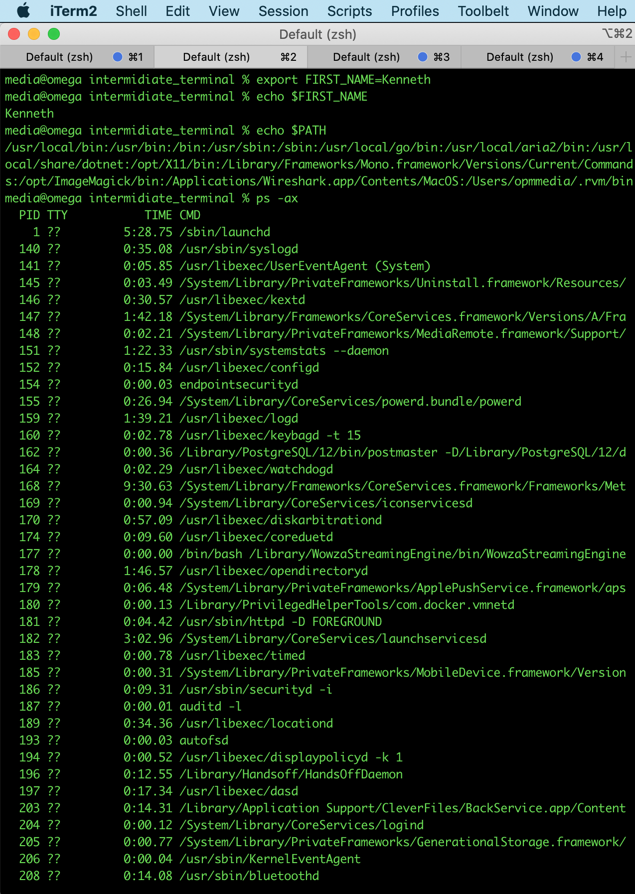

# Intermediate Terminal Exercises

### Part I

Answer the following questions:

1. Create an environment variable called `FIRST_NAME` and set it equal to your first name (this does not need to be permanent) `export FIRST_NAME=Kenneth`
2. Print the `FIRST_NAME` variable `echo $FIRST_NAME`
3. Print out the `$PATH` variable `echo $PATH`
4. What is the `$PATH` variable? **It is a set of paths for our environment to find where to run commands**
5. Why would you want to create an environment variable? **For securing information and using a variable multiple times**
6. How do you permanently save environment variables? **Save them in your .bash_profile or .zshrc**
7. What is a process? **a process is a specific computer program that is being excecuted**
8. How do you list all processes running on your machine? `ps -ax`
9. What is a PID? **A unique identifier for for a process which is necessary when stopping a process**
10. How do you terminate a process? **You can use `kill` or `kill -9`**
11. What is the difference between `kill` and `kill -9`? **9 is a specific signal ensures that the command can not be ignored, whereas without the -9 there may be processes that are not killed by using `kill` alone.**
12. What `grep` flag allows for case insensitive search? `-i`
13. What `grep` flag allows for a certain number of lines before the match? `-B`
14. What `grep` flag allows for a certain number of lines around the match? `-C`
15. What `grep` flag allows for a certain number of lines after the match? `-A`
16. What `grep` flag allows for full word search? `-w`
17. What `grep` flag shows you the line number of a match? `-n`

### Part II

Write the following terminal commands to do the following (assume that `instructors.txt` is an imaginary file):

1. Find all files inside the `Desktop` folder that have a name of "learn." `find ~/Desktop -name "learn"`
2. Find all files inside the `Desktop` folder that start with a "P." `find ~/Desktop -name "P.*" `
3. Find all files inside the `Desktop` folder that end with `.txt`. `find ~/Desktop -name "*.txt" `
3. Find all files inside the `Desktop/views` folder that have the name `data` somewhere in their filename. `find ~/Desktop/views -name "*data*" `
4. Inside of the `instructors.txt` file, output the number of times the word "Elie" appears. `grep -c "Elie" instructors.txt`
4. Inside of the `instructors.txt` file, list all matches for any full word that starts with a capital "P." `grep -w "P.*" instructors.txt`
5. Inside of the `instructors.txt` file, list all the line numbers for any full word that starts with a "z" (it should match regardless of upper or lower case). `grep -ni "z.*" instructors.txt`

