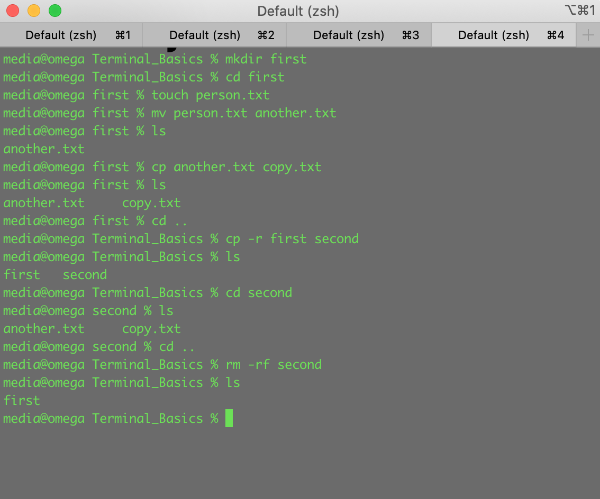

# Terminal Basics Exercise

### Part I

#### Here are the Commands i executed
- make a directory called first  `mkdir first`
- change directory to the first folder `cd first`
- create a file called person.txt `touch person.txt`
- change the name of the file to another.txt `mv person.txt another.txt`
- make a copy of the another.txt file and call it copy.txt `cp another.txt copy.txt`
- remove the copy.txt file `rm copy.txt`
- make a copy of the first folder and call it second `cp -r first second`
- delete the second folder `rm -rf second`

### Part II

#### Question 1
- What does the man command do? Type in man rm. How do you scroll and get out?

#### Answer
- The man command lists the manual for a command. **- D or Control ⌃-D to advance half a page**
  **- B or Control ⌃-B to go back one page**
  **- U or Control ⌃-U to go back half a page**

#### Question 2
- Look at the man page for ls. What does the -l flag do? What does the
  `-a` flag -do? 

#### Answer
- **The `-l` flag lists files in a list format with more detail and the `-a` lists all files and folders including hidden ones**

#### Question 3
- Type the following command to download and save the contents of google.com: curl https://www.google.com > google.html `curl https://www.google.com > google.html`

- Use less to look at the contents of google.html. `less google.html`

- Look at the man page for less. Read the section on /pattern. Search for the text hplogo in the google.html file. `less -p hplogo google.html`

- How do you jump between words in the terminal? `option left/right`

- How do you get to the end of a line in terminal? `control + e`

- How do you move your cursor to the beginning in terminal? `control + a`
  How do you delete a word (without pressing backspace multiple times) in -terminal? `option + delete`

- What is the difference between a terminal and shell? **The terminal is a program is just an interface to the shell. The shell is what actually handles commands and so forth; the terminal program just gives it a way to interact with the environment.**

- What is an absolute path? **An absolute path is a path that starts from the root route and gives the complete location for a file or folder**

- What is an relative path? **A relative path is a path that starts at the current location and not the root route**

- What is a flag? Give three examples of flags you have used. **A flag adds additional functionality to an existing command, we have seen `-a` and `-l` for the `ls` command and `-r` for the `cp` and `rm` commands**

- What do the r and f flags do with the rm command? **`r` will remove folders and recursively go through each folder and file and `f` will force removal**
